# Chest X-ray Classifier — Dataset & Model Versioning + Dashboards (A3)

A3 adds versioning and monitoring to the chest X-ray pneumonia classifier from A1 (training)
and A2 (deployment): every dataset and model version is recorded in **MLflow**, a
**Streamlit app** serves predictions from any registered version, and a **Grafana**
dashboard shows dataset statistics, model performance and data drift — all started with
one `docker compose up`.

- **A1:** ResNet18 fine-tuned on the Kaggle chest X-ray dataset (NORMAL vs PNEUMONIA).
- **A2:** that model served as a FastAPI container on Cloud Run —
  [DanGherghiceanu/A2-deployment](https://github.com/DanGherghiceanu/A2-deployment).
- **A3 (this repo):** versioning, drift, comparison and dashboards.
- [DanGherghiceanu/A3-versioning-dashboards](https://github.com/DanGherghiceanu/A3-versioning-dashboards)

> Coursework screening aid. Not a diagnostic device.

---

## Why versioning — the problem from A1

A1 recorded two runs of the same notebook that scored **84.9%** and **86.7%** test accuracy on
different days, and could only *guess* why. Nothing proved which data, code and model
produced each number. This project makes that provable: every dataset version has a
content **digest**, every model version links to the run and the dataset digest it was
trained on, and a full rebuild from scratch reproduced every deterministic number exactly
(see [Reproducibility check](#reproducibility-check)).

---

## Requirements → where to find them

| Requirement | Where |
|---|---|
| **Step 1 — Dataset versioning:** track versions, metadata, history, ≥2 versions | `scripts/01_version_datasets.py` · MLflow experiment `xray-datasets` · [Step 1](#step-1--dataset-versioning) |
| **Step 2 — Model versioning:** register A1 model, second version on drifted data, compare metrics, MLflow screenshots | `scripts/02_register_models.py` · registered model `xray-pneumonia-classifier` · [Step 2](#step-2--model-versioning) |
| **Step 3 — MLflow app:** dataset selector, model selector, prediction, metrics, comparison charts | `app/` · http://localhost:8501 · [Step 3](#step-3--the-mlflow-app) |
| **Step 4 — Grafana:** dataset stats, model performance, drift indicators, storytelling | `grafana/` · http://localhost:3000 · [Step 4](#step-4--grafana-dashboard) |
| **Docker Compose app** | `docker-compose.yml` — Postgres, MLflow, app, Grafana |
| **Screenshots** | `screenshots/` |

---

## Architecture

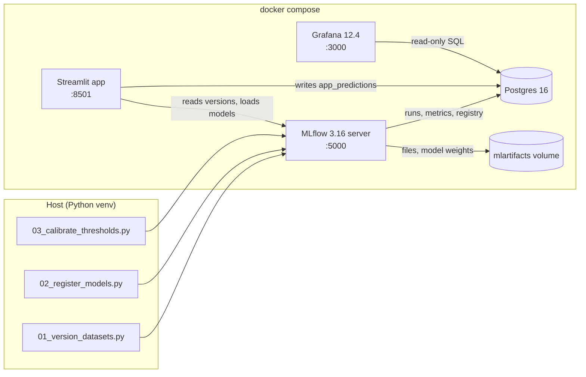

**One database, two readers.** MLflow stores every run, metric, dataset record, registered
model and alias in Postgres. The app adds one table, `app_predictions`, with a row per
prediction it serves. Grafana reads both with plain SQL through a **read-only** login — no
extra pipeline, and the dashboard can never modify the registry.

| Service | Image | Port | Purpose |
|---|---|---|---|
| `postgres` | `postgres:16` | 5432 | MLflow backend store + prediction log |
| `mlflow` | built from `mlflow/` (MLflow 3.16.1) | 5000 | Tracking server, model registry, artifact store |
| `app` | built from `app/` (Streamlit 1.64, torch 2.13 CPU) | 8501 | Version selectors, predictions, metrics, comparisons |
| `grafana-db-user` | `postgres:16` | — | One-shot job: creates the read-only `grafana` login |
| `grafana` | `grafana/grafana:12.4.11` | 3000 | Provisioned datasource + dashboard |

---

## Repository layout

```
.
├── docker-compose.yml
├── .env.example                 A1_RAW_DIR - path to the A1 images (copy to .env)
├── requirements.txt             host scripts (MLflow client, pandas, sklearn …)
├── requirements-torch.txt       torch 2.13 / torchvision 0.28, CPU wheels
├── mlflow/Dockerfile            MLflow server + Postgres driver
├── scripts/
│   ├── 01_version_datasets.py   Step 1: dataset v1 + drifted v2 → MLflow
│   ├── 02_register_models.py    Step 2: register A1 model, drift model, control
│   └── 03_calibrate_thresholds.py  Step 2b: thresholds chosen on validation
├── app/                         Step 3: Streamlit app
│   ├── app.py                   UI (4 tabs)
│   ├── registry.py              reads datasets/models/metrics from MLflow
│   ├── inference.py             model loading + A1 preprocessing
│   └── monitoring.py            prediction log → Postgres
├── grafana/                     Step 4
│   ├── provisioning/            datasource + dashboard loader
│   ├── dashboards/xray-monitoring.json
│   ├── build_dashboard.py       generates the dashboard JSON (dashboard as code)
│   └── readonly-user.sql
├── data/versions/v1, v2/        manifests, dataset cards, histograms (images are git-ignored)
├── logs/                        console output of the run-2 rebuild
└── screenshots/
```

Not in the repo: the image data (5,856 X-rays; the manifests record exactly which files) and
the A1 checkpoint `resnet18_finetuned.pt` (44.8 MB, in the A2 repo under `models/`).

---

## Quick start

**Prerequisites:** Docker Desktop, Python 3.12, the A1 project folder with its dataset and
`data/processed/split_manifest.json`, and the A1 checkpoint from the A2 repo.
Commands are PowerShell.

```powershell
# 1. Machine-specific path to the A1 images
copy .env.example .env          # then edit A1_RAW_DIR if your path differs

# 2. Start Postgres + MLflow + app + Grafana
docker compose up -d --build
docker compose ps -a             # grafana-db-user: Exited (0); others: Up

# 3. Host environment for the scripts
py -3.12 -m venv .venv
.\.venv\Scripts\Activate.ps1
pip install --index-url https://download.pytorch.org/whl/cpu -r requirements-torch.txt
pip install -r requirements.txt

# 4. Steps 1, 2, 2b  (~1 h on CPU, mostly the two fine-tunes)
python scripts\01_version_datasets.py --a1-root "E:\...\Dan_ML_main\AI_ML_Vanier_A1"
python scripts\02_register_models.py --checkpoint "..\a2-deployment\models\resnet18_finetuned.pt"
python scripts\03_calibrate_thresholds.py
```

Then open:

| | |
|---|---|
| MLflow | http://localhost:5000 |
| App | http://localhost:8501 (first load 20–40 s: torch import + model download) |
| Grafana | http://localhost:3000 (anonymous viewer; admin/admin to edit) |

To feed the live-traffic panels, use the app's **Predict → Simulate traffic** in this
order, 100 images each, a minute or more apart:

| # | Sidebar model | Images from | Shows |
|---|---|---|---|
| 1 | v1 · A1 baseline | v1 | normal operation |
| 2 | v1 · A1 baseline | v2 | drift arrives |
| 3 | v2 · drift-retrained @champion | v2 | the fix |
| 4 | v2 · drift-retrained @champion | v1 | retrained model still works on old images |

All three scripts are **idempotent**: re-running skips anything already logged, so a crash
halfway is fixed by running the same command again.

---

## Step 1 — Dataset versioning

`scripts/01_version_datasets.py`

MLflow has no feature literally called a "data registry"; its dataset tracking
(`mlflow.data` + `mlflow.log_input`) fills that role. Each version is one run in the
experiment **`xray-datasets`**:

- **Datasets:** the train / val / test splits as MLflow Datasets, each with a content
  **digest** — a hash of a table with one row per image (path, split, label, brightness,
  contrast). Change one label or one pixel and the digest changes.
- **Params:** version, parent version, seed, drift settings.
- **Metrics:** counts, class balance, image statistics, drift scores (PSI).
- **Artifacts:** `manifest.csv`, a dataset card, intensity histograms, before/after samples.
- **Guard rails:** same version + same digest → skipped; same version name with *different*
  contents → the script refuses and asks for a new version name.

| | v1 | v2 |
|---|---|---|
| What it is | A1's data exactly: same files, same 85/15 split (seed 42), original Kaggle test set | v1 through a simulated **new scanner**: contrast ×0.6, brightness ×1.15, slight blur |
| Digest | `4fb98ef0` | `d63bfd99` |
| Images (train / val / test) | 4447 / 785 / 624 | identical |
| % PNEUMONIA (test) | 62.5 | identical |
| Mean brightness | 122.8 | **140.3** |
| Mean contrast (pixel std) | 56.9 | **38.9** |

Only the pixels differ, so any change in model behaviour between v1 and v2 is caused by the
drift alone.

**Drift scores (PSI, v2 vs v1):** brightness **0.78**, contrast **6.84**
(<0.1 stable, 0.1–0.25 moderate, >0.25 major).

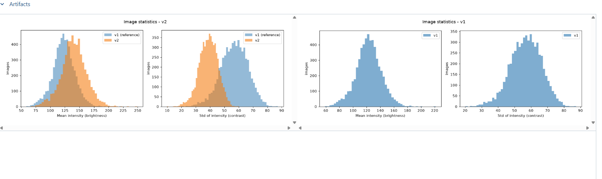
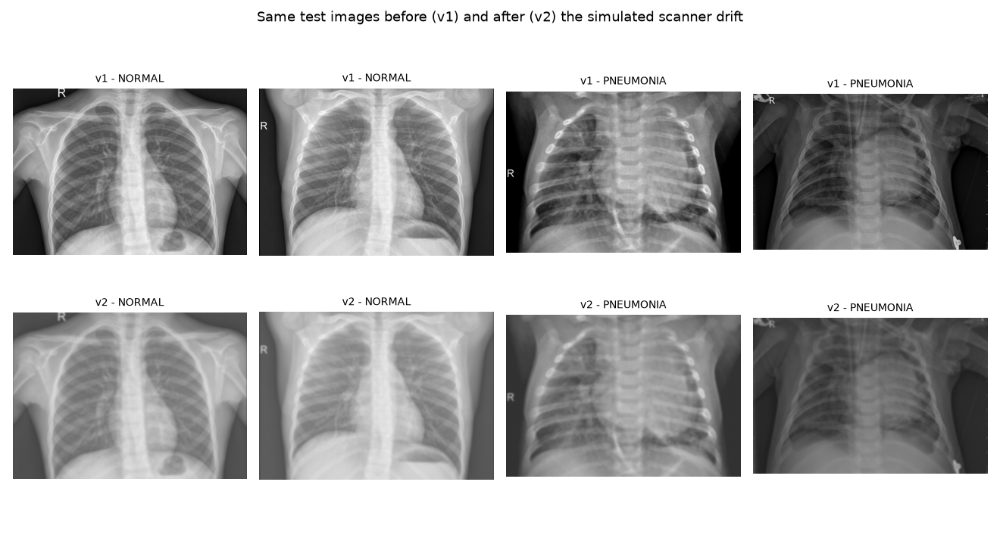

---

## Step 2 — Model versioning

`scripts/02_register_models.py` — registered model **`xray-pneumonia-classifier`**
(experiment `xray-models`).

| Version | Role (tag `model_role`) | Alias | What it is |
|---|---|---|---|
| 1 | `baseline` | `@baseline` | The A1 ResNet18, imported unchanged with its A1 training parameters |
| 2 | `retrained_for_drift` | `@champion` | Version 1 loaded **from the registry** and fine-tuned 2 epochs on data v2 |
| 3 | `control` | `@control` | Version 1 fine-tuned with the **identical recipe** on data v1 |

Every run records its training and evaluation datasets as MLflow inputs, so each model
version traces back to an exact dataset digest. Every version is evaluated on **both** test
sets. `@champion` = the best macro F1 on the current (drifted) data. The app loads models by
alias, so promoting a new model is a one-line alias change with no code change.

**Why a control?** Version 2 differs from version 1 in two ways — more training *and*
drifted data. The control differs from version 2 only in the data, which splits the effect.

### Results (test sets, threshold 0.50)

| Model | Test set | Accuracy | Macro F1 | ROC-AUC | NORMAL recall | PNEUMONIA recall |
|---|---|---|---|---|---|---|
| v1 A1 baseline | v1 (original) | 0.849 | 0.822 | 0.973 | 0.607 | 0.995 |
| v1 A1 baseline | v2 (drifted) | 0.782 | **0.721** | 0.962 | **0.419** | 1.000 |
| v2 drift-retrained | v1 | 0.939 | 0.935 | 0.979 | 0.902 | 0.962 |
| v2 drift-retrained | v2 | 0.861 | 0.837 | 0.976 | 0.637 | 0.995 |
| v3 control | v1 | 0.902 | 0.890 | 0.983 | 0.752 | 0.992 |
| v3 control | v2 | 0.769 | 0.701 | 0.980 | 0.389 | 0.997 |

Where the drift model's macro-F1 gain came from:

| Test set | Total (v2 − v1) | Extra training (control − v1) | Drifted data (v2 − control) |
|---|---|---|---|
| v1 | +0.113 | +0.068 | +0.045 |
| v2 | +0.116 | **−0.020** | **+0.136** |

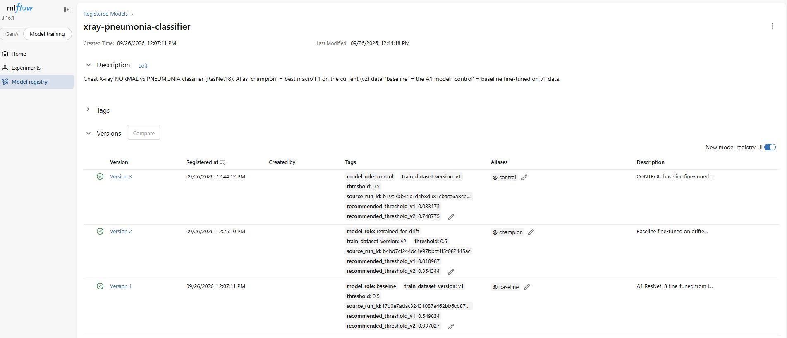
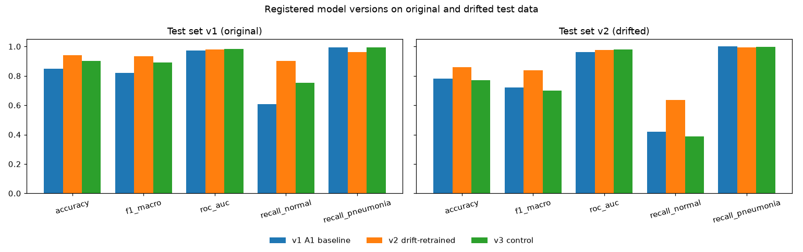

### Step 2b — Choosing the threshold honestly

`scripts/03_calibrate_thresholds.py`

Sliding the threshold on the test set and keeping the best value is **test-set leakage**:
the test set was used to make a decision, so the score is optimistic. The honest procedure,
applied to every model and dataset: choose the threshold that maximises macro F1 on the
**validation** split, then score the untouched **test** split. Results are logged as
`calibrate-vN` runs, and each model version is tagged `recommended_threshold_v1` /
`_v2` so the threshold travels with the model. The "oracle" (best threshold found by peeking
at test) is reported only to measure how optimistic peeking would be.

| Model | Data | Val threshold | Test F1 @0.50 | Test F1 @ val threshold | Oracle F1 (peeking) |
|---|---|---|---|---|---|
| v1 A1 baseline | v1 | 0.550 | 0.822 | 0.828 | 0.923 |
| v1 A1 baseline | v2 | 0.937 | 0.721 | **0.811** | 0.899 |
| v2 drift-retrained | v1 | 0.011 | 0.935 | 0.819 | 0.939 |
| v2 drift-retrained | v2 | 0.354 | 0.837 | 0.800 | 0.935 |
| v3 control | v1 | 0.083 | 0.890 | 0.781 | 0.939 |
| v3 control | v2 | 0.741 | 0.701 | 0.769 | 0.929 |

---

## Step 3 — The MLflow app

`app/` · http://localhost:8501

A Streamlit front end over the registry. It never trains or writes to MLflow; everything it
shows comes from the runs logged in Steps 1–2b.

| Requirement | In the app |
|---|---|
| Dataset version selector | Sidebar — every version in `xray-datasets`, with its digest |
| Model version selector | Sidebar — every registered version with its aliases; opens on `@champion` |
| Prediction interface | **Predict** tab — a test image from the chosen dataset or an upload; verdict, P(pneumonia) against the threshold, ground truth, brightness/contrast; optionally every model version on the same image; **Simulate traffic** batches |
| Metrics visualisation | **Dataset** tab (counts, PSI, histograms, samples) · **Model metrics** tab (metrics, threshold chosen on validation, F1-vs-threshold curve, confusion matrix and probability histogram on a log-odds axis, training curves) |
| Model comparison charts | **Compare models** tab — every version × test set, ROC curves, the F1 waterfall (extra training vs drifted data), validation-threshold results |

Every prediction is written to `app_predictions` in Postgres (source, model version,
dataset version, truth, probability, brightness, contrast, latency) — the live data for
Grafana.

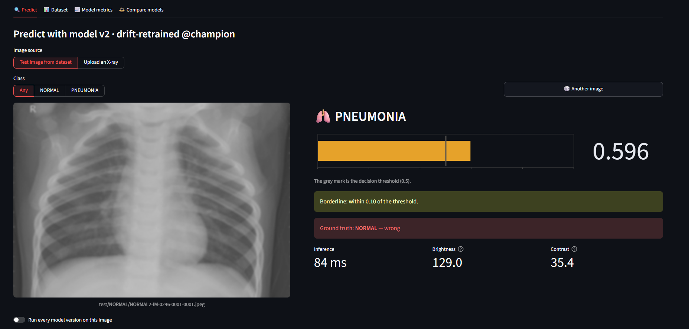
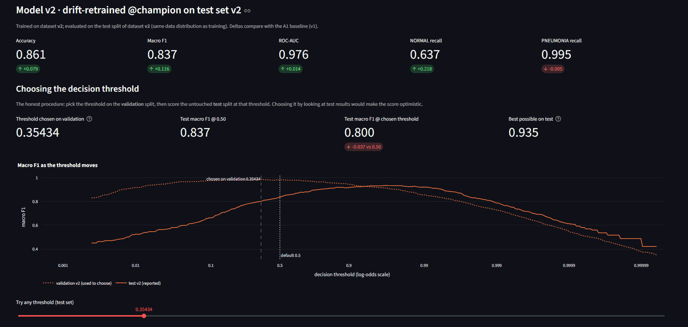
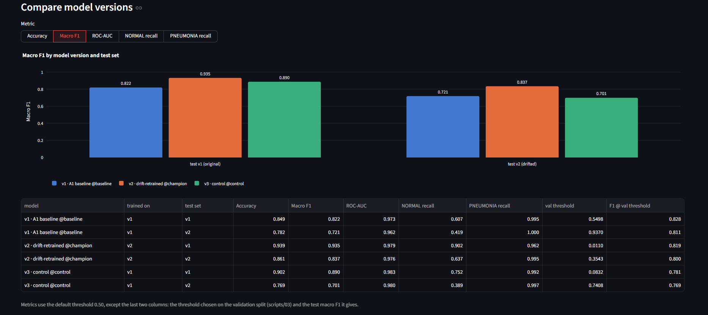

---

## Step 4 — Grafana dashboard

`grafana/` · http://localhost:3000 — **"X-ray classifier — versions & drift"**

Fully provisioned from files: datasource, dashboard folder and dashboard load on startup, so
`docker compose up` on a fresh machine shows the same dashboard. `grafana/build_dashboard.py`
generates the dashboard JSON; every panel's SQL was tested against MLflow's Postgres
schema. Grafana connects as a **read-only** user (`grafana/readonly-user.sql`).

It is laid out as a story in three acts:

| Act | Panels | Requirement |
|---|---|---|
| **① The data** | Dataset versions table (digest, counts, drift applied) · PSI drift scores coloured green/orange/red · brightness & contrast by version | Dataset statistics, drift indicators |
| **② The models** | Registry table (aliases, trained-on, F1, validation threshold) · any metric by model and test set (**Metric** selector) · default vs honest vs peeking threshold · fine-tuning curves | Model performance |
| **③ Live traffic** | Last-100 tiles (predicted vs actual PNEUMONIA share, brightness shift, accuracy) · **the story, batch by batch** · brightness per batch · batch summary · per-minute time series with batch markers · prediction log | Drift indicators, visual storytelling |

Batches are detected in SQL (a new batch starts when the model or the image dataset
changes, or after a pause >60 s). A **Traffic** selector hides hand-picked predictions by
default. Model colours match the app (v1 blue, v2 orange, v3 green); dataset colours are
v1 blue, v2 orange.

What the live traffic showed (first round):

| Batch | Predicted PNEUMONIA | Actually PNEUMONIA | Accuracy | Brightness |
|---|---|---|---|---|
| #1 model v1 · v1 images | 66% | 54% | 86% | 121 |
| #2 model v1 · **v2 images** | **90%** | 63% | **73%** | **135** |
| #3 model v2 · v1 images | 62% | 61% | 97% | 124 |
| #4 model v2 · v2 images | 77% | 60% | 83% | 136 |

The drift is visible **without labels** in two places: incoming brightness jumps by about
15 points, and the old model's PNEUMONIA share jumps well above the true share.

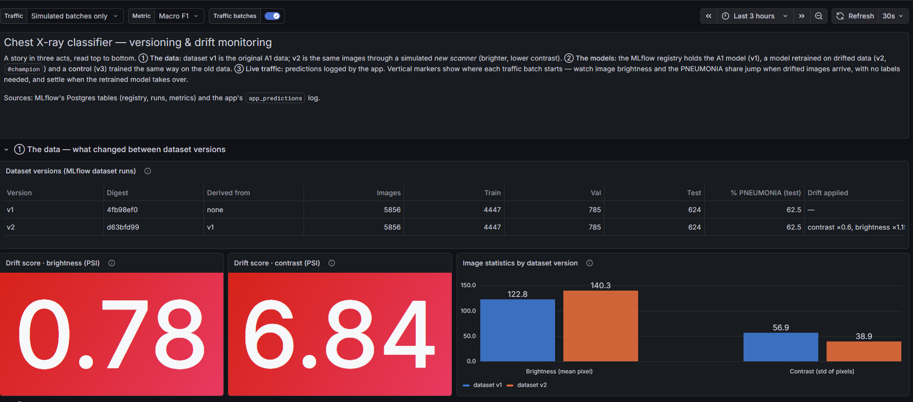
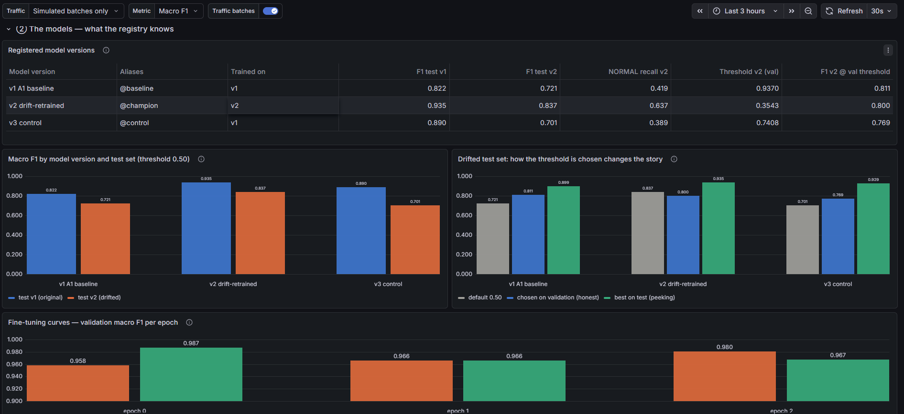
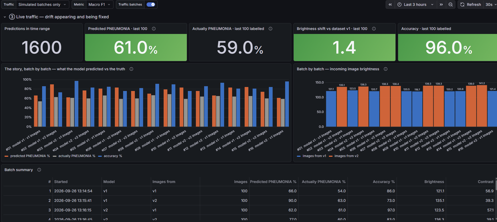

---

## Findings

1. **The simulated drift is mostly a calibration shift.** Brighter, flatter images pushed
   predicted probabilities up: NORMAL recall fell from 0.61 to 0.42 at threshold 0.50 while
   ROC-AUC barely moved (0.973 → 0.962). The model still *ranks* X-rays correctly; its
   cut-off is in the wrong place.
2. **Honest recalibration recovers most of the loss.** A threshold chosen on drifted
   validation data (0.937) lifts the A1 model on drifted test data from 0.721 to 0.811
   macro F1 — about 90% of the way back to its pre-drift 0.822 — with no retraining.
3. **More training on old data does not fix drift.** The control, trained longer on the
   old images, did not improve on drifted data (extra-training effect −0.056 in run 1,
   −0.020 in run 2). The recovery came from data of the new distribution (+0.161 / +0.136).
4. **A second shift was there all along.** Validation F1 is 0.98–0.99 for every model, yet
   the test-optimal thresholds sit at 0.95–0.997 for most model/data pairs, even on
   undrifted data. The Kaggle test set comes from a different source than train/val (A1's
   known val/test gap), and validation data cannot calibrate for a shift it does not contain.
5. **Single-threshold comparisons mislead.** With thresholds chosen fairly, all three
   versions land within 0.77–0.83 test F1; with oracle thresholds within 0.90–0.94; all
   have ROC-AUC 0.96–0.98. Much of the gap at 0.50 reflects how each model's probabilities
   happen to line up with the test source.
6. **Differences below ~0.04 F1 between retrained models are noise** — measured, not
   assumed (next section).
7. **In production** this system would calibrate on a labelled sample from the deployment
   source, watch the predicted-positive rate and input image statistics (both label-free) to
   trigger recalibration or retraining, and make training deterministic or report
   mean ± spread over several seeds.

---

## Reproducibility check

The whole stack was rebuilt from nothing (`docker compose down -v`, then all three scripts
again) and the results compared with the first run.

| | Run 1 → Run 2 |
|---|---|
| Dataset digests `4fb98ef0`, `d63bfd99` and every dataset metric | **identical** |
| Model v1 (A1 baseline): every metric, both validation thresholds | **identical** |
| Model v2 (drift-retrained), macro F1 on test v1 / v2 | 0.929 → 0.935 / 0.826 → 0.837 |
| Model v3 (control), macro F1 on test v1 / v2 | 0.884 → 0.890 / 0.665 → **0.701** |
| Validation thresholds of retrained models | moved (e.g. control on v2: 0.909 → 0.741) |

Everything that involves no training reproduces bit for bit — the digests prove the data is
the same. Retraining with the same code, data digest, seed and packages still varied by up
to **3.6 F1 points**, because PyTorch training on CPU is not bit-deterministic by default
(multi-threaded floating-point sums run in varying order). That is enough to explain A1's
1.8-point gap without any package change. `torch.use_deterministic_algorithms(True)` with
single-threaded training would remove most of it, at a cost in speed. Every conclusion
above held in both runs; only the size of the training effects moved.

---

## Troubleshooting

Everything below was hit while building this.

| Symptom | Cause and fix |
|---|---|
| MLflow returns **403** to the app or scripts | MLflow 3 rejects unknown `Host` headers. `--allowed-hosts` must list `mlflow:5000` (container-to-container) and `localhost:5000`, **with** the port |
| An experiment opens on an empty "Traces / GenAI" page | MLflow 3 guessed the experiment was GenAI. The scripts tag experiments `mlflow.experimentKind = custom_model_development`; runs are also at `#/experiments/<id>/runs` |
| `UnicodeEncodeError` when piping a script into `Tee-Object` | MLflow prints emoji; piped output uses cp1252 on Windows. Run `$env:PYTHONUTF8 = "1"` and `[Console]::OutputEncoding = [System.Text.Encoding]::UTF8` first |
| `port 5432 is already allocated` | A local Postgres is running. Change the mapping to `"5433:5432"` |
| Everything is gone after a restart | `docker compose down -v` deletes the volumes. Use `docker compose down` to keep data |
| App shows "Image not found" | `A1_RAW_DIR` in `.env` doesn't point at the folder with `train/ val/ test/`, or `data/versions/v2/images` doesn't exist (run Step 1) |
| App's first page load takes ~40 s | One-time torch import and model download from MLflow; cached afterwards |
| Grafana time charts look empty | The time range doesn't cover your traffic batches — widen it (e.g. "Last 3 hours") |
| Grafana "No data" everywhere | `docker compose logs grafana-db-user` — the read-only user must have been created (Exited (0)) |

---

## Limitations and possible improvements

- **Synthetic drift.** A real scanner change would also alter noise, resolution and
  anatomy framing; this drift is deliberately simple so its effect can be isolated.
- **One training seed per model.** Differences under ~0.04 F1 between retrained models
  are within measured noise; multiple seeds would give error bars.
- **Validation is unrepresentative of test.** A calibration split drawn from the test
  *source* would give better thresholds (finding 4).
- **Hard-coded local credentials** (Postgres, Grafana admin). Fine on localhost; a real
  deployment needs secrets management.
- **Traffic is simulated** and carries labels; real traffic would not, which is why the
  dashboard leads with the label-free signals (brightness, predicted-positive share).
- **No alerting yet.** Grafana alert rules on the PSI or brightness-shift panels would turn
  the dashboard into an automatic drift alarm.

---

## Credits

Dataset: Kermany, Zhang & Goldbaum, *Labeled Optical Coherence Tomography (OCT) and Chest
X-Ray Images for Classification* (CC BY 4.0), via
[Kaggle](https://www.kaggle.com/datasets/paultimothymooney/chest-xray-pneumonia).
Built on MLflow, Streamlit, Plotly, PyTorch and Grafana.
